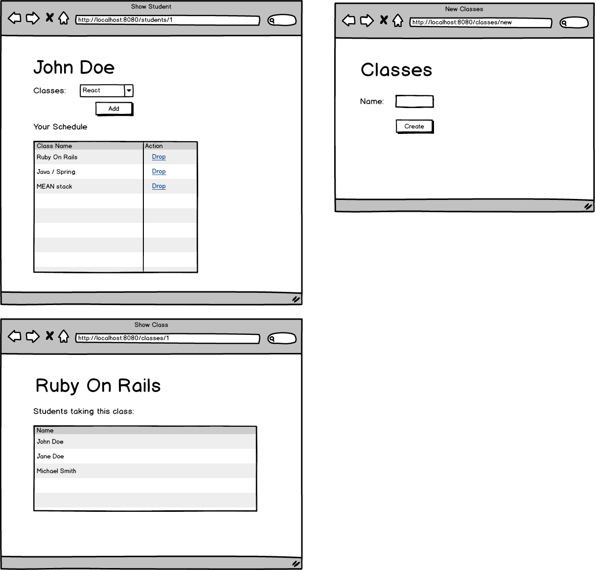

## Student Roster III
In this assignment, you will practice many-to-many relationships by building upon the Student Roster I and Student Roster II assignments. In addition to what we already have, we will have a way to create classes and a way for students to sign up to classes. Analyze the wireframe below and create the appropriate domain models with the correct relationships.

**Wireframe**


**Set Up**

Creating the web view for this assignment will be optional (only if you are behind schedule). We will continue using the ```ApiService``` from the previous two Student Roster assignments. Complete each task below.

**Tasks:**

● Have a method handler in the controller for the following example url: ```/classes/create?name=Java```. Create multiple classes.

● Have a method handler in the controller for the following example url: ```/students/2/add?class=1```. This method should add the class with id 1 to the student with id 2. Add multiple classes to multiple students.

● Have a method handler in the controller for the following example url: ```/classes/1```. This method should display in the console all the students taking the class with id 1. This method should work with any class.

**Optional (Only if behind):**

● Create the web view for this assignment.

● Create a page where you can create classes

● In the student show page, allow the ability to add classes. Once added, update the schedule table.

● Allow the ability for a student to drop a specific class.

● In the classes show page, display all the students taking a specfic class.

**Topics:**

● n:m relationships

● JPA methods

